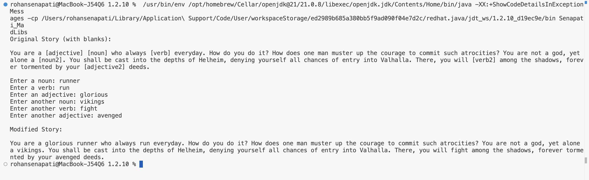
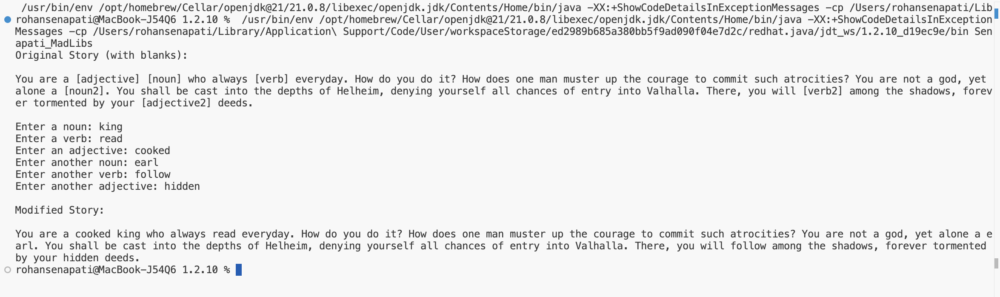
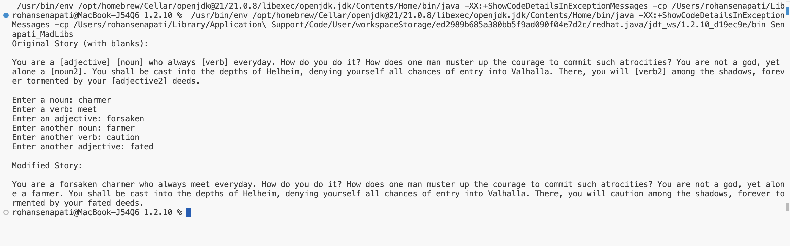

# 1.2.10-Madlib

# Senapati_MadLibs

## Overview
This project is a Madlibs word-substitution generator created in Java, and asks the user for different types of words and inserts them into my Norse-mythology story.  

## Approach and Development Process
I first implemented the program as a baseline using simple string concatenation to insert user input into the story. After that, I refactored it to use my story template with placeholders and the .replace() method to substitute user input, which allowed me to display the original story and meet parsing requirements.  

- used Scanner to collect user input from console  
- created a story template with 6 placeholders ([noun], [verb], [adjective] twice each)  
- substituted the user’s input into the template using the .replace() string method  
- displayed both the original story template and final modified story

## Mad Libs Milestones

| Milestones                        | Estimated Time to Develop | Actual Time to Develop |
|-----------------------------------|--------------------------|-----------------------|
| Create the Mad Lib riddles         | 25 min                   | 30 min                |
| Find each part of speech to replace| 10 min                   | 15 min                |
| Show each part of speech to the user| 5 min                   | 10 min                |
| Get the user’s response            | 5 min                    | 5 min                 |
| Store the user’s response          | 5 min                    | 5 min                 |
| Insert responses into the story    | 10 min                   | 15 min                |
| Display final Mad Lib story        | 5 min                    | 5 min                 |

## Example Runs
### 1st run

### 2nd run

### 3rd run

## Reflection
I started with a baseline version using simple string concatenation to insert user input into the story. While this confirmed the basic program logic, it didn’t allow me to display the original story or use string parsing methods.  

Refactoring to a story template with placeholders and the .replace() method made the program cleaner and more structured. It allowed me to display the original story template, substitute user input efficiently, and meet all parsing requirements.  

The PriceCalculator bellringer exercise helped prepare me for this assignment by introducing its workflow. Although the bellringer worked with numbers instead of words, it taught me how to handle multiple inputs and variables, which made implementing the Madlibs program easier.  
